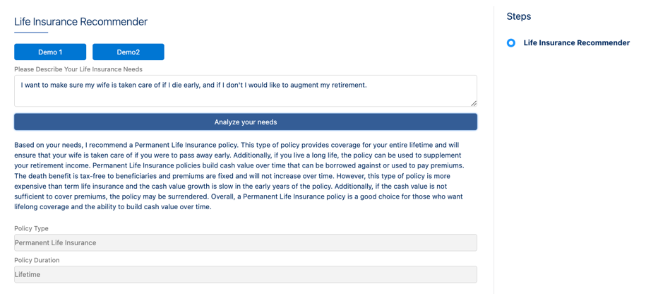

# Life Insurance Recommender V2
A second version of the OmniScript GPT Demo that shows how to get structured data back from ChatGPT in JSON (the first version just retrieved free text).

 

## Installation

You must have a version of Salesforce with OmniStudio to use this.  

There are two .json files:

* Life Ins Recommender Omnistudio NS.json
* Life Ins Recommender Vlocity NS.json

If you are using the older, Vlocity namespaced package, use the second one.  Otherwise, use the first.

Import the correct .json file into Omnistudio, and activate the Integration Procedure but not the OmniScript.

This expects that you have a named credential called OpenAI that is configured to provide your OpenAI API Key. 

Full details are given in two posts on my substack, starting with this [post on creating a named credential](https://mcguinnessai.substack.com/p/fixing-the-one-glaring-problem-so).

